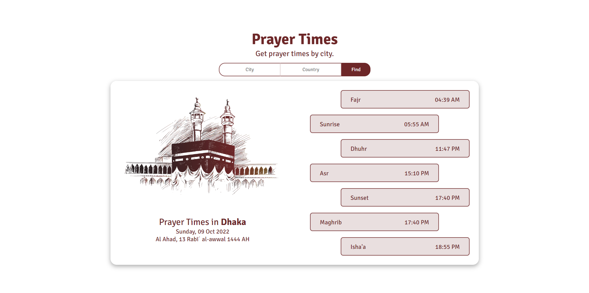

# Prayer Times App

Prayer Times App is a fun project. Purpose of this project is to learn and implement Angular. We used `Angular CLI` to create different componets, services amd models. The prayer times data is fetched from [Prayer Times API](https://aladhan.com/prayer-times-api).

## Demo



</br>

## Installation

**Step(1):** Clone the project
```
https://github.com/nayeemsweb/PrayerTimesApp.git
```

**Step(2):** Enter into the project directory
```
cd PrayerTimesApp
```

**Step(3):** Open `Terminal` and run the project
```
ng serve -o
```

## Pre-requisites

⚠️ Pre-requisites: Must be installed on your machine - 
- [Node Js](https://nodejs.org/en/)
- [npm](https://docs.npmjs.com/downloading-and-installing-node-js-and-npm)

_`npm` is included with Node.js installation. After you install Node.js, verify `npm` installation by writing the following command in terminal or command prompt._
```
npm -v
```
- [Angular](https://angular.io/)
- [TypeScript](https://www.typescriptlang.org/)

## API Reference

We used the [Prayer Times API](https://aladhan.com/prayer-times-api) for fetching the data based on `city` and `country`.

🌎 **Example Request:** [http://api.aladhan.com/v1/timingsByCity?city=Dhaka&country=Bangladesh](http://api.aladhan.com/v1/timingsByCity?city=Dhaka&country=Bangladesh)

| Parameter | Type     | Description                       |
| :-------- | :------- | :-------------------------------- |
| `city`      | `string` | **Required**. City of the Prayer Times to fetch |
| `country`      | `string` | **Required**. Country of the Prayer Times to fetch |

## Support

❤️ If you do like my work, hit the ⭐️ button above. ❤️

## License

[MIT](https://choosealicense.com/licenses/mit/)
